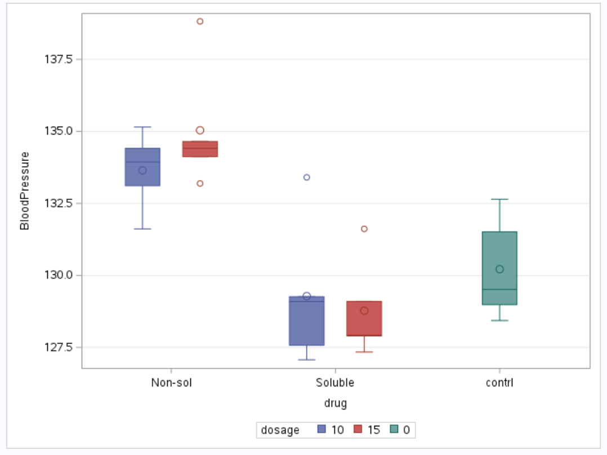
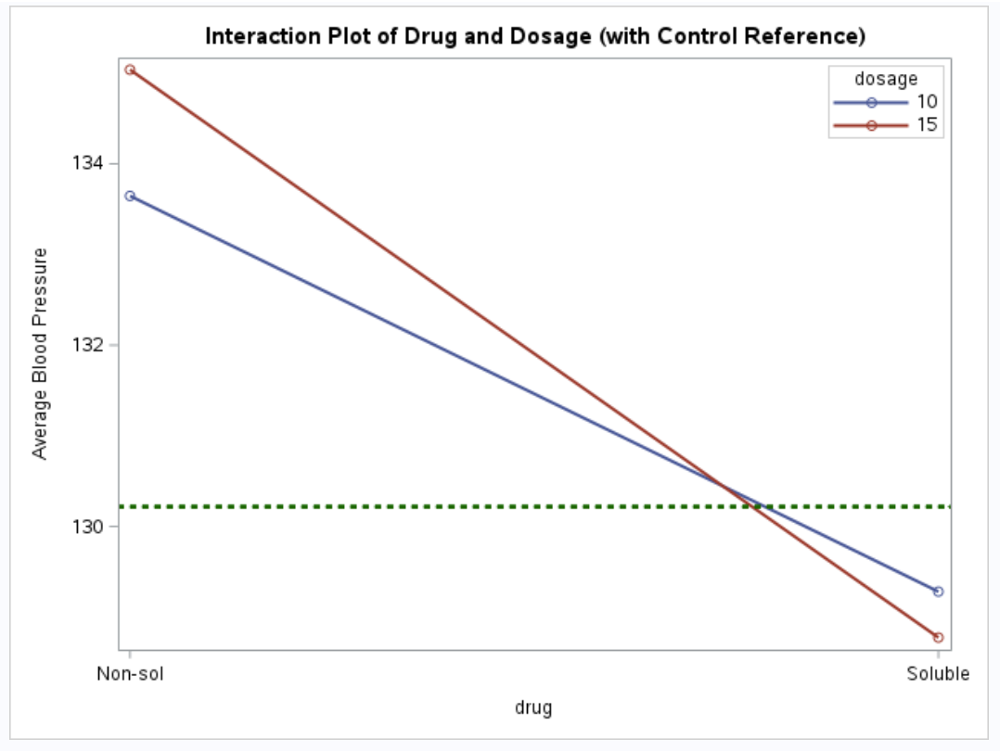

We extend our discussion of a 2 × 2 factorial design with control to a 2 × 2 factorial design with control and blocks. If blocks are used, treatments are randomized within each block. This results in a randomized complete block design (RCBD), where each treatment (including control if embedded) appears once per block.

Recall, in a 2 × 2 factorial design with control presented in the chapter 1, the four factorial combinations were: A1B1, A1B2, A2B1, A2B2. The control treatment (C) was treated as a fifth, independent treatment, outside the factorial combinations. It was not associated with any level of factor A or B. The control is usually included as a reference, not involved in interaction effects. For a 2 × 2 factorial with control and blocks, this allows the analysis to:

1.  Control for block-to-block variation

2.  Compare each factorial treatment to the control within and across blocks

3.  Estimate main effects and interaction effects within the factorial structure

4.  Maintain orthogonality between blocks and treatments

\newpage

We present the general framework of the anova structure for this design and later illustrate with an example how to implement the techniques on a real data. The analysis of variance for a 2 × 2 factorial design with control and blocks is shown using the SAS. The data statement in SAS creates the data frame with source of variation and degrees of freedom. The anova table presented in this chapter is similar to the one in the previous chapter. The only addition this time is the extra source of variation, which is the block and its corresponding degrees of freedom.

``` sas
 data anova_table;
    length Source $15 Degrees_of_Freedom $20;
    
    Source = "Block"; 
    Degrees_of_Freedom = "r - 1"; 
    output;

    Source = "Factor A"; 
    Degrees_of_Freedom = "a - 1"; 
    output;

    Source = "Factor B"; 
    Degrees_of_Freedom = "b - 1"; 
    output;

    Source = "A × B"; 
    Degrees_of_Freedom = "(a - 1)(b - 1)"; 
    output;

    Source = "Control"; 
    Degrees_of_Freedom = "1"; 
    output;

    Source = "Error"; 
    Degrees_of_Freedom = "n - [r + ab]"; 
    output;

    Source = "Total"; 
    Degrees_of_Freedom = "n - 1"; 
    output;
run;

proc print data=anova_table noobs;
run;
```


## **Example**

Researchers are interested in evaluating the effect of two drugs on blood pressure. They want to know whether the drug type (soluble vs. non-soluble) and dosage (10 units vs. 15 units) influence outcomes. A control group (placebo) is also included to serve as a baseline for comparison and the study is conducted in five clinics. Furthermore, to reduce variability arising from different clinics and other extraneous factors, the experiment is conducted as a randomized complete block design where clinics are considered as blocks.

The SAS code below presents a summary table which describes how the experiment was conducted, that is, the type of treatments, and replicates per clinics. From the output below, we have five replicates of each treatment combination. This is because each treatment combination appears once in each clinic(block). We also have five replicates of the control.

``` sas
data drug_table;
    length 
        Drug_Type $15
        Dosage 8
        Description $20
        Replicates_per_Clinic_Block $30;

    Drug_Type = "Soluble";
    Dosage = 10;
    Description = "Treatment A1B1";
    Replicates_per_Clinic_Block = "1 per clinic × 5 clinics = 5";
    output;

    Drug_Type = "Soluble";
    Dosage = 15;
    Description = "Treatment A1B2";
    Replicates_per_Clinic_Block = "5";
    output;

    Drug_Type = "Non-soluble";
    Dosage = 10;
    Description = "Treatment A2B1";
    Replicates_per_Clinic_Block = "5";
    output;

    Drug_Type = "Non-soluble";
    Dosage = 15;
    Description = "Treatment A2B2";
    Replicates_per_Clinic_Block = "5";
    output;

    Drug_Type = "No Drug";
    Dosage = 0;
    Description = "Control";
    Replicates_per_Clinic_Block = "5 (1 in each clinic)";
    output;
run;

proc print data=drug_table noobs label;
    label 
        Drug_Type = "Drug Type"
        Replicates_per_Clinic_Block = "Replicates per Clinic (Block)";
run;
```

 \newpage

In this RCBD, each clinic receives all treatments, including the control exactly once, which are randomly assigned within the clinic. We present the anova table using SAS. We see that the sources of variation are clinic, drug type, dosage, drug type × dosage, control, Error from experimental units. We also show the degrees of freedom in the table below. We see from the output that the degree of freedom for clinic is 4. The degrees of freedom for drug type and dosage are 1 respectively, as well as their interaction. Lastly, the degrees of freedom for the control and error terms are 1 and 9 respectively. We use the proc print to print our results as we did in the previous chapter.

``` sas
data anova_table;
    length Source $15 Degrees_of_Freedom $20;
    
    Source = "Block"; 
    Degrees_of_Freedom = "5 - 1"; 
    output;

    Source = "Factor A"; 
    Degrees_of_Freedom = "2 - 1"; 
    output;

    Source = "Factor B"; 
    Degrees_of_Freedom = "2 - 1"; 
    output;

    Source = "A × B"; 
    Degrees_of_Freedom = "(2 - 1)(2 - 1)"; 
    output;

    Source = "Control"; 
    Degrees_of_Freedom = "1"; 
    output;

    Source = "Error"; 
    Degrees_of_Freedom = "25 - [5 + 4]"; 
    output;

    Source = "Total"; 
    Degrees_of_Freedom = "25 - 1"; 
    output;
run;

proc print data=anova_table noobs;
run;
```


\newpage

## **Model**

Next, we present the statistical model for the design above. The model below is similar to the model in chapter 1. In this model, we include the block term. Note that we do not assume block by interaction in this model. Also, blocks are considered fixed.

$y_{ijk} = \mu + \beta_{i} + \tau_{jl} + \delta_{kl} + \tau\delta_{jkl} + control_{l} + \epsilon_{ijkl}$

where,

$y_{ijk}$ is the blood pressure of the kth individual using the ith drug type at the jth dose

$\mu$ is the intercept

$\beta_{i}$ is the effect from the ith block, block is considered fixed

$\tau_{jl}$ is the effect from the jth drug type nested in the Control

$\delta_{kl}$ is the effect from the kth dose level nested in the control

$\tau\delta_{jkl}$ is the interaction between drug type and dosage level in the Control

$control_{l}$ is the control

$\epsilon_{ijkl}$ is the residual, $\epsilon_{ijkl}$ \~ $N(0,\sigma^{2})$

\newpage

Recall, for a 2 × 2 factorial design with a control, we created a control variable that nests the treatment combination. In this section, we also create a control variable that nests the treatments and control. Where "n" indicates there is no control and "y" indicates otherwise just as we showed in chapter 1. The goal is to allow for comparison between treatments and the control.

The SAS code below shows the data frame including the control variable. In the SAS code, we have 5 clinics with 5 treatments in each clinics. As we showed in the previous chapter, data was also simulated from the Gaussian distribution. The only addition here is the block term and variance that includes clinic level effects.

``` sas
options ps=64 ls=100;

Data bpdata_block;
INPUT block drug$ dosage BloodPressure control$;
if drug='Control' then do;
drug ='contrl';
forms = 0;
formn = 0;
end;
else if drug ='Soluble' then do;
forms = dosage;
formn = 0;
end;
else if drug='Non-sol' then do;
forms = 0;
formn = dosage;
end;
cards;
1 Soluble 10 129.0941 n
1 Soluble 15 127.34 n
1 Non-sol 10 131.614 n
1 Non-sol 15 133.1922 n
1 Control 0 128.4334 y
2 Soluble 10 129.2637 n
2 Soluble 15 127.8995 n
2 Non-sol 10 133.9404 n
2 Non-sol 15 134.6503 n
2 Control 0 128.9838 y
3 Soluble 10 133.4043 n
3 Soluble 15 131.6153 n
3 Non-sol 10 135.1508 n
3 Non-sol 15 138.8188 n
3 Control 0 132.6446 y
4 Soluble 10 127.5732 n
4 Soluble 15 127.923 n
4 Non-sol 10 133.115 n
4 Non-sol 15 134.4121 n
4 Control 0 129.516 y
5 Soluble 10 127.0719 n
5 Soluble 15 129.0964 n
5 Non-sol 10 134.4119 n
5 Non-sol 15 134.1204 n
5 Control 0 131.5124 y

;
proc print; 
run;
```


\newpage

We explore the data for the treatment and control through a boxplot. Based on the boxplots of blood pressure stratified by drug formulation and dosage shown below, clear differences in the distributional characteristics of the treatments were observed. For both soluble and non-soluble formulations, the boxplots indicate moderate spread in blood pressure values, with the interquartile ranges (IQRs) capturing most of the observed variability within each dosage level. The soluble treatments exhibited relatively lower median blood pressure values compared with the non-soluble treatments at corresponding dosages, suggesting a stronger blood-pressure--lowering effect. In contrast, the non-soluble formulations showed higher medians and slightly wider IQRs, particularly at the higher dosage level, indicating greater variability in response.

The control group displayed the widest overall spread among the treatments, with a higher median blood pressure and longer whiskers, reflecting increased variability in the absence of treatment. Across treatments, the distributions appeared approximately symmetric, although mild right-skewness was evident for some non-soluble dosage groups, as indicated by longer upper whiskers.

``` sas
/* Boxplot */
proc sgplot data=bpdata_block;
    vbox BloodPressure / category=drug group=dosage;
    yaxis grid;
run;
```



\newpage

Next, we take a look at the interaction plot. In particular, we are interested to see if there is an interaction between drug type and dosage. From the plot, we see that there is an interaction between drug and dosage. This is shown by the red and blue line. We need to confirm from the anova table.

``` sas
/* Interaction Plot */
data bp_plot;
    set bpdata_block;
    if drug ^= "contrl";
run;

/* Compute mean BloodPressure for Drug × Dosage */
proc means data=bp_plot noprint;
    class drug dosage;
    var BloodPressure;
    output out=means_plot mean=MeanBP;
run;

/* Remove _TYPE_ and _FREQ_ rows from PROC MEANS */
data means_plot_clean;
    set means_plot;
    if _TYPE_ = 3; /* Keeps only Drug × Dosage combos */
run;

data means_plot_clean;
    set means_plot;
    if _TYPE_ = 3; /* Keeps only Drug × Dosage combos */
run;

/* Get Control mean */
proc means data=bpdata_block noprint;
    where drug = "contrl";
    var BloodPressure;
    output out=control_mean mean=ControlMean;
run;

/* Add ControlMean to all rows for plotting */
data plot_ready;
    if _n_ = 1 then set control_mean;
    set means_plot_clean;
run;

/* Interaction Plot with Control Mean Line */
proc sgplot data=plot_ready;
    series x=drug y=MeanBP / group=dosage lineattrs=(thickness=2) markers;
    refline ControlMean / 
    axis=y lineattrs=(color=darkgreen pattern=shortdash thickness=2) 
    label="Control Mean";
    yaxis label="Average Blood Pressure";
    xaxis label="drug";
    keylegend / location=inside position=topright across=1;
    title "Interaction Plot of Drug and Dosage (with Control Reference)";
run;
```



\newpage

The table below shows the variance components for clinic (block) and residual if clinic were to be treated as random. Looking at the table, the variance for clinic(block) is $2.7212$ and the variance for residual is $1.0665$. The block variance measures how much of the total variability in the response variable is being explained by the block. In this example, we see that a larger proportion of the total variation is due to the block.

``` sas
proc glimmix data = bpdata_block; 
class block drug dosage control;
model BloodPressure =  control drug(control) dosage(control)
  drug*dosage(control)/solution ddfm=kr; 
random block;
run;
```


\newpage

Next, we obtain the ANOVA table that shows the sources of variations, degrees of freedom, F-values and p-values. In SAS, this is shown by the Type III Tests of Fixed Effects table. From the output shown below, we see that the sources of variation are control, drug, dosage and drug by dosage interaction effect all nested in the control variable. Recall that the variable called control is created to identify the actual treatments and the control group. Therefore, "Control : Drug" for example means that the source of variation for drug type not including the control group. We know that we have two level for drug type : Soluble and Non-soluble. Thus, the degrees of freedom for each of these sources of variation are correct.

To identify which terms are statistically significant, we take a look at the F-values and the p-values. F-values that are far greater than $1$ can be considered to be statistically significant. We see that the p-values corresponding to those values are also statistically significant. For the interaction term, we have a p-value of $0.0565$. That can be considered as marginally significant. The only term that is not statistically significant is Dosage which has a p-value of $0.3519$. This is because it has an F-value of $0.92$ which is less than $1$.

``` sas
proc glimmix data = bpdata_block; 
class block drug dosage control;
model BloodPressure =  control drug(control) 
  dosage(control) drug*dosage(control)/solution ddfm=kr; 
random block;
run;
```


\newpage

Next, we show the estimated marginal means table also in the output below. This is obtained using the lsmeans statement. The estimated mean for non-soluble and soluble drugs at 10 percent dosage level were $133.65$ and $129.28$ respectively similar to the results obtained in R. Also, for non-soluble and soluble drugs at 15 percent dosage, the estimated means were $135.04$ and $128.77$ respectively. Lastly, the estimate for control is $130$, which is higher than all other treatment combinations. There is one thing that is obvious from these estimates. That is, the estimated mean value for control group is different from those from the treatment. In particular, the value for the control group is less than those in the non-soluble group but larger than those in the soluble group.

``` sas
proc glimmix data = bpdata_block; 
class block drug dosage control;
model BloodPressure =  control drug(control)
  dosage(control) drug*dosage(control)/solution ddfm=kr; 
lsmeans drug*dosage(control);
random block;
run;
```


\newpage

We also show the main effect of treatment versus control. We see from the output that there is a significant difference between treatment and control group. The p-value is $0.0118$. Now this comparison is usually of importance in these types of design. Recall, we created a variable "Control" with entries "y" for where we had a control and "n" otherwise. We are able to compare the control group to the treatments because of this variable.

``` sas
proc glimmix data = bpdata_block; 
class block drug dosage control;
model BloodPressure =  control drug(control)
  dosage(control) drug*dosage(control)/solution ddfm=kr; 
lsmeans control / diff = control adjust=dunnett cl;
random block;
run;
```

 \newpage

Next, we also compare the main effects of drug. The reader should note that we do this for completeness. Nevertheless, when there is a significant interaction effect like the one we have in this example, the main effect is meaningless. It is advisable to obtain the simple effects. For drug type, we again see a significant difference in effect between non-soluble drug and soluble drug. The p-value is less than $0.0001$.

``` sas
proc glimmix data = bpdata_block; 
class block drug dosage control;
model BloodPressure =  control drug(control) 
  dosage(control) drug*dosage(control)/solution ddfm=kr;
contrast 'Soluble vs Non-soluble' drug(control) 1 -1 0; 
lsmeans drug(control) / diff = control adjust=dunnett cl;
random block;
run;
```

 \newpage

Next, we show the contrast comparing each level of drug by dosage combination. This is known as the simple effect where we look at the difference between two levels of a treatment at a given level of another treatment. From the output below, we see that the difference between Non-soluble drug and Soluble at a dosage of 10 and 15 units is statistically significant. The p-values are less than $0.0001$ respectively. This means that whether a drug is soluble or not affects blood pressure, nevertheless, we do not have any statistical evidence to determine whether increasing the dosage from 10 to 15 units has makes a difference on blood pressure. This is shown by the adjusted p-values $0.1460$ for dosage at 10 units compared to dosage at 15 units when non-soluble drugs are considered.

``` sas
proc glimmix data = bpdata_block; 
class block drug dosage control;
model BloodPressure =  control drug(control)
  dosage(control) drug*dosage(control)/solution ddfm=kr; 
lsmeans drug*dosage(control) / diff = control adjust=dunnett cl;
random block;
run;
```

 \newpage

We would like to emphasize that in all the comparison, we used the Dunnet test as an adjustment. This is because with multiple comparison, we may stand the chance of making a type 1 error. In cases where we are interested in comparing treatments to control like this example, we can use the Dunnett test to control for such error.

## Conclusion

In conclusion, we can see that there is a significant difference in effect between treatments and control. This is shown in the contrast statements above where the estimate between no control "n" and control "y" is $1.4673$ with a p-value of $0.0118$. Lastly, taking a look at the contrast statements for just the treatments, we see a significant difference in effect between non-soluble and soluble drug when dosage is at 10 and 15 units respectively but not for dosage. We see that the 2 × 2 factorial with control and block allowed us to efficiently account for the variation arising from clinics(blocks) while objectively comparing treatments and control. Also, analyzing the data with the appropriate model allowed us to make the right inference.
