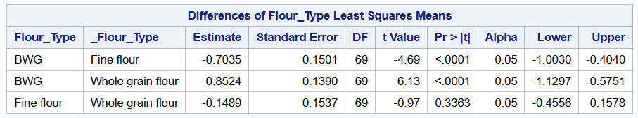
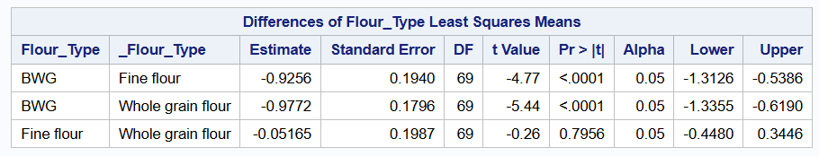
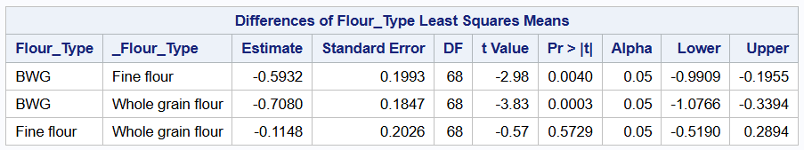
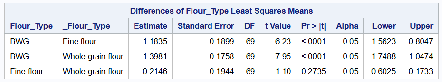
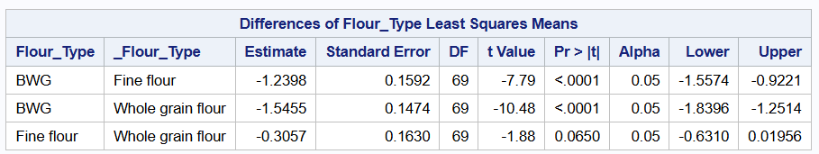
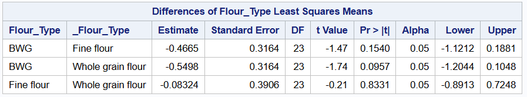
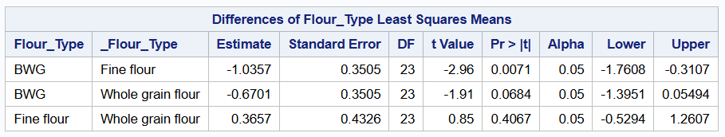
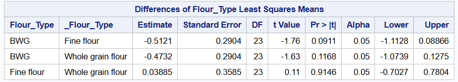
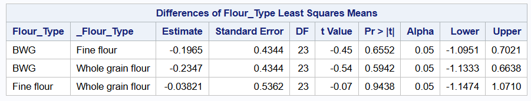
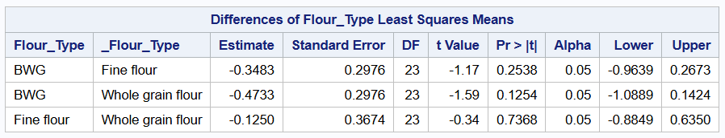

```{r setup, include=FALSE}
knitr::opts_chunk$set(echo = TRUE, message = FALSE, warning = FALSE, fig.align = 'center')
```

\newpage 

# Summary

A complete randomized design that evaluates the effect between three treatments BFF (Fine flour), BWF (Whole flour) and BWG was conducted in the years 2024 and 2025. The response variables were APC, EB, Coliform, Yeast, Molds. There were in total 98 observations with only 26 of the observations from the year 2025. Data on the two years were analyzed separately because of some differences in the characteristics of the data. The client is interested in finding if there is any significant difference in effect between BWF and BWG, and BWG and BFF.


# Data Description
Data set contains seven variables, year (block), treatment and 5 response variables which will be analyzed separately. There were two blocks and three levels of treatment.The exploratory data analysis was done in R while the model fit was done using SAS. 

```{r load-packages, warning=FALSE, message=FALSE,echo=FALSE}
      
library(ggplot2)   
library(dplyr)     
library(knitr)     
library(tidyverse)
```


```{r load-data, echo=FALSE}
flour <- read.csv("flour_type.csv")
flour$Molds <- as.numeric(flour$Molds)
# Subsetting the data
flour_2024 <- flour %>% 
  filter(Year == 2024)
flour_2025 <- flour %>%
  filter(Year == 2025)
write.csv(flour_2024,"flour_2024.csv")
write.csv(flour_2025,"flour_2025.csv")
# Print few row of the data
head(flour)
```

# Exploratory Data Analysis (EDA)

Before fitting a formal statistical model, we explore the data visually to identify trends, patterns, and potential interactions between the factors. We show interaction plots for each of the response variables to determine if there is any significant block by treatment interaction.


```{r, echo=FALSE}
with(flour, interaction.plot(Flour_Type, Year, APC,
                          xlab = "flour type",
                          ylab = "APC",
                          legend = TRUE,
                          col = 1:5,
                          lwd = 2))

with(flour, interaction.plot(Flour_Type, Year, coliform,
                          xlab = "flour type",
                          ylab = "coliform",
                          legend = TRUE,
                          col = 1:5,
                          lwd = 2))

with(flour, interaction.plot(Flour_Type, Year, EB,
                          xlab = "flour type",
                          ylab = "EB",
                          legend = TRUE,
                          col = 1:5,
                          lwd = 2))

with(flour, interaction.plot(Flour_Type, Year, Yeast,
                          xlab = "flour type",
                          ylab = "Yeast",
                          legend = TRUE,
                          col = 1:5,
                          lwd = 2))

with(flour, interaction.plot(Flour_Type, Year, Molds,
                          xlab = "flour type",
                          ylab = "Molds",
                          legend = TRUE,
                          col = 1:5,
                          lwd = 2))
```

# Interpretation of interaction plot

The plots above show the interaction between year and flour type. For APC, we see that the lines for the years 2024 and 2025 are parallel and this shows there is no block by flour type interaction. Nevertheless, the rest of the response variables show significant block by flour type interaction effect.

## Distribution of E. coli Load by Factors

Boxplots can help us visualize the overall distribution of each of the response variables.

```{r boxplots1,out.width = '60%',fig.cap="\\label{fig:fig1}Distribution of E. coli Load by Flour Type", echo=FALSE}
# APC as a Response
ggplot(flour, aes(x = Flour_Type, y = APC, fill = Flour_Type)) +
  geom_boxplot() +
  labs(
    title = "Boxplot of APC by Flour Type",
    x = "Flour Type",
    y = "APC"
  ) +
  theme_minimal()

# Coliform as a Response
ggplot(flour, aes(x = Flour_Type, y = coliform, fill = Flour_Type)) +
  geom_boxplot() +
  labs(
    title = "Boxplot of Coliform by Flour Type",
    x = "Flour Type",
    y = "Coliform"
  ) +
  theme_minimal()

# EB as a Response
ggplot(flour, aes(x = Flour_Type, y = EB, fill = Flour_Type)) +
  geom_boxplot() +
  labs(
    title = "Boxplot of EB by Flour Type",
    x = "Flour Type",
    y = "EB"
  ) +
  theme_minimal()

# Yeast as a Response
ggplot(flour, aes(x = Flour_Type, y = Yeast, fill = Flour_Type)) +
  geom_boxplot() +
  labs(
    title = "Boxplot of Yeast by Flour Type",
    x = "Flour Type",
    y = "Yeast"
  ) +
  theme_minimal()

# Molds as a Response
ggplot(flour, aes(x = Flour_Type, y = Molds, fill = Flour_Type)) +
  geom_boxplot() +
  labs(
    title = "Boxplot of Molds by Flour Type",
    x = "Flour Type",
    y = "Mold"
  ) +
  theme_minimal()

```


# Interpretation of boxplots

The boxplots above show the first, second and third quartiles for each response variable, where the second quartile is the mean or median across the years 2024 and 2025. For APC,we see that the means and variances ,shown by the middle line and size of boxplots respectively, are not the same.Flour type, BWG has the lowest average APC but with the highest variance. We also see a few outliers in fine flour type and whole grain flour type respectively.
 
For Coliform, we see that there are a lot of outliers in BWG. Also, we see that there is high variability in the fine flou type and whole grain flour type. From the boxplot, we cannot really tell whether there is a significant difference between fine flour type and whole grain flour, but both flour types differ from BWG.

For EB, we see again that the means for the various flour types differ, with BWG again having the lowest mean EB value. The variability in the three flour types are again different. This is shown in the size of the boxplots. We see similar plot for Yeast.

For molds, the mean value for fine flour and whole grain flour types are about the same. This is shown by the middle line in the green and blue boxplots. Nevertheless, whole grain flour has higher variability than fine flour. We also see that BWG has the lowest mean value but the largest variability. Looking at the boxplots for all the 5 response variables tells us that the distribution of the data does not follow the normal distribution. Because the assumption of homogeneous variance fails.

\newpage

A quick look at the relative density plot shown below confirms that the distribution is not gaussian (normal).

```{r, echo=FALSE}
# Relative Frequency Density of APC
ggplot(flour, aes(x = APC)) +
  geom_density(fill = "skyblue", color = "black", alpha = 0.6) +
  labs(
    title = "Density Plot of APC",
    x = "APC",
    y = "Density"
  ) +
  theme_minimal()

## Relative Frequency Density of Coliform
ggplot(flour, aes(x = coliform)) +
  geom_density(fill = "skyblue", color = "black", alpha = 0.6) +
  labs(
    title = "Density Plot of Coliform",
    x = "Coliform",
    y = "Density"
  ) +
  theme_minimal()

## Relative Frequency Density of EB
ggplot(flour, aes(x = EB)) +
  geom_density(fill = "skyblue", color = "black", alpha = 0.6) +
  labs(
    title = "Density Plot of EB",
    x = "EB",
    y = "Density"
  ) +
  theme_minimal()

## Relative Frequency Density of Yeast
ggplot(flour, aes(x = Yeast)) +
  geom_density(fill = "skyblue", color = "black", alpha = 0.6) +
  labs(
    title = "Density Plot of Yeast",
    x = "Yeast",
    y = "Density"
  ) +
  theme_minimal()

## Relative Frequency Density of Mold
ggplot(flour, aes(x = Molds)) +
  geom_density(fill = "skyblue", color = "black", alpha = 0.6) +
  labs(
    title = "Density Plot of Molds",
    x = "Molds",
    y = "Density"
  ) +
  theme_minimal()
```

The relative frequency density plots above show that Coliform, EB, Yeast and Molds have bimodal shape. To understand whether the peaks are as a result of flour type differences or the blocks, we subsetted the data and looked at the distribution of all the variables. The distribution of the subsetted data is not shown because the client is not interested in those plots. But from the plots, we still see bimodal shapes for the variables which show that the peaks are as a result of the treatments. This in itself tells us that at least one flour type differs from the others. 

\newpage

Nevertheless, we show the boxplot for each treatment in each year. The plots below show boxplots for each flour type and for each variable in the year 2024.

```{r, echo=FALSE}
# Year 2024 Data

# APC as a Response
ggplot(flour_2024, aes(x = Flour_Type, y = APC, fill = Flour_Type)) +
  geom_boxplot() +
  labs(
    title = "Boxplot of APC by Flour Type in 2024",
    x = "Flour Type",
    y = "APC"
  ) +
  theme_minimal()

# Coliform as a Response
ggplot(flour_2024, aes(x = Flour_Type, y = coliform, fill = Flour_Type)) +
  geom_boxplot() +
  labs(
    title = "Boxplot of Coliform by Flour Type in 2024",
    x = "Flour Type",
    y = "Coliform"
  ) +
  theme_minimal()

# EB as a Response
ggplot(flour_2024, aes(x = Flour_Type, y = EB, fill = Flour_Type)) +
  geom_boxplot() +
  labs(
    title = "Boxplot of EB by Flour Type in 2024",
    x = "Flour Type",
    y = "EB"
  ) +
  theme_minimal()

# Yeast as a Response
ggplot(flour_2024, aes(x = Flour_Type, y = Yeast, fill = Flour_Type)) +
  geom_boxplot() +
  labs(
    title = "Boxplot of Yeast by Flour Type in 2024",
    x = "Flour Type",
    y = "Yeast"
  ) +
  theme_minimal()

# Molds as a Response
ggplot(flour_2024, aes(x = Flour_Type, y = Molds, fill = Flour_Type)) +
  geom_boxplot() +
  labs(
    title = "Boxplot of Molds by Flour Type in 2024",
    x = "Flour Type",
    y = "Mold"
  ) +
  theme_minimal()
```
\newpage

The boxplots below for each flour type in the year 2025 for each variable is shown.

```{r, echo=FALSE}
# 2025 Data 
# APC as a Response
ggplot(flour_2025, aes(x = Flour_Type, y = APC, fill = Flour_Type)) +
  geom_boxplot() +
  labs(
    title = "Boxplot of APC by Flour Type in 2025",
    x = "Flour Type",
    y = "APC"
  ) +
  theme_minimal()

# Coliform as a Response
ggplot(flour_2025, aes(x = Flour_Type, y = coliform, fill = Flour_Type)) +
  geom_boxplot() +
  labs(
    title = "Boxplot of Coliform by Flour Type in 2025",
    x = "Flour Type",
    y = "Coliform"
  ) +
  theme_minimal()

# EB as a Response
ggplot(flour_2025, aes(x = Flour_Type, y = EB, fill = Flour_Type)) +
  geom_boxplot() +
  labs(
    title = "Boxplot of EB by Flour Type in 2025",
    x = "Flour Type",
    y = "EB"
  ) +
  theme_minimal()

# Yeast as a Response
ggplot(flour_2025, aes(x = Flour_Type, y = Yeast, fill = Flour_Type)) +
  geom_boxplot() +
  labs(
    title = "Boxplot of Yeast by Flour Type in 2025",
    x = "Flour Type",
    y = "Yeast"
  ) +
  theme_minimal()

# Molds as a Response
ggplot(flour_2025, aes(x = Flour_Type, y = Molds, fill = Flour_Type)) +
  geom_boxplot() +
  labs(
    title = "Boxplot of Molds by Flour Type in 2025",
    x = "Flour Type",
    y = "Mold"
  ) +
  theme_minimal()
```

Based on the boxplots, we analyze the data for the two years separately. The rest of the analysis is done in SAS using a generalized linear model. Results from SAS, are show in this file and the SAS code is attached for client's use. From the SAS output, we look at the Fit Statistics table for all the variables and we see that the values for the $Pearson Chi-Square / DF$ is less than one. This shows that the gamma distribution was a good fit for the data. The plots are not included in the report because the client was not interested in that but code can be run to see the output.

# Experimental Design and Skeleton ANOVA

The experimental design is a completely randomized design with flour type as treatment and the response variables are assumed to follow a gamma distribution. The general format of the statistical model is given below for all response variables. Note that the same model is used for both data sets.

# Statistical Model

\[
Y_i \sim \text{Gamma}(\mu_i, \phi), \qquad i = 1,\ldots,n,
\]

\[
g(\mu_i) = \eta_i = \mu + \text{Flour}_i,
\]

\[
\text{where } g(\cdot) \text{ is the canonical inverse link.}
\]


# Results

The results of the analysis done in SAS is presented below.We show the Fit Statistics tables, Type III Test of Fixed Effects Tables and Differences of Treatment Means tables for flour types in each year.

# Fit Statistics and Type III Tests of Fixed Effects Tables


For APC, the $\frac{Pearson Chi-Square}{Df} = 0.24$ which is less than 1 and thus, the model is a good fit. We also show the Type III Tests of Fixed Effects table who shows a significant difference in treatment effect. The $p-value < 0.0001$ for flour type. The fit statistics for all other variables are presented in the SAS file. Results are shown here and the interpretations are same for all other variables in 2024.


Fit Statistics and Type III Test of Fixed Effects Table for Coliform is shown and we see that there is a significant difference in the effect of flour type.


Fit Statistics and Type III Test of Fixed Effects Table for Molds is shown and we see that there is a significant difference in the effect of flour type.


# Differences in flour types for 2024 data

For each variable, the client was interested in determining if there was a significant difference among flour types and if so, which flour type differed from the other. We show the Differences of Flour Type 
Least Square Means Table for each of the variables in 2024.



We see there is a significant difference in effect between BWG and Fine flour, and BWG and Whole grain flour. The p-values are less than 0.0001. But there no significant difference in effect between Fine flour and Whole grain flour, the p-value is $0.3363$.



We again see there is a significant difference in effect between BWG and Fine flour, and BWG and Whole grain flour. The p-values are less than 0.0001. But there no significant difference in effect between Fine flour and Whole grain flour, the p-value is $0.7956$.



We again see there is a significant difference in effect between BWG and Fine flour, and BWG and Whole grain flour. The p-values are less than 0.0001. But there no significant difference in effect between Fine flour and Whole grain flour, the p-value is $0.5729$.



We again see there is a significant difference in effect between BWG and Fine flour, and BWG and Whole grain flour when EB was used as the response. The p-values are less than 0.0001. But there no significant difference in effect between Fine flour and Whole grain flour, the p-value is $0.2735$.



Lastly, we see there is a significant difference in effect between BWG and Fine flour, and BWG and Whole grain flour. The p-values are less than 0.0001. But there no significant difference in effect between Fine flour and Whole grain flour, the p-value is $0.0650$. But one may consider this p-value as marginally significant.

Similar interpretation is given for results in the 2025 data. We only show the Differences of Flour Type 
Least Square Means Table for data in 2025.


# Differences in flour types for 2024 data



For APC 2025 data, we see that all flour types are not significantly different. The p-values are greater than $0.05$.



For Coliform 2025 data, we see that only BWG and Fine flour are significantly different but all other flour types are not significantly different. The p-values for BWG and Fine flour is $0.0071$ but those of BWG and Whole grain flour and Fine flour and Whole grain flour are greater than $0.05$.



For Molds 2025 data, we see that all flour types are not significantly different. The p-values are greater than $0.05$.



For EB 2025 data, we see that all flour types are not significantly different. The p-values are greater than $0.05$.



Lastly, for Yeast 2025 data, we see that all flour types are not significantly different. The p-values are greater than $0.05$.

\newpage
# Conclusion

From the results, the effect of the flour types seems to differ between the two years. Also, the sample size of the data in 2025 and very small, but the client is encouraged to assess what happened between the two years. Was there a significant change in weather and environment conditions. Also, further experiment can be conducted to assess whether treatments truly differ from each other and thus, the differences we see in 2024 is not due to environment or the year.