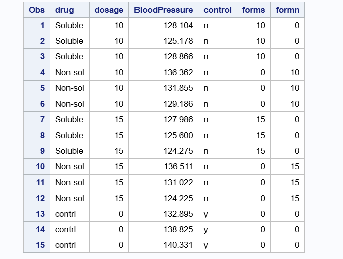
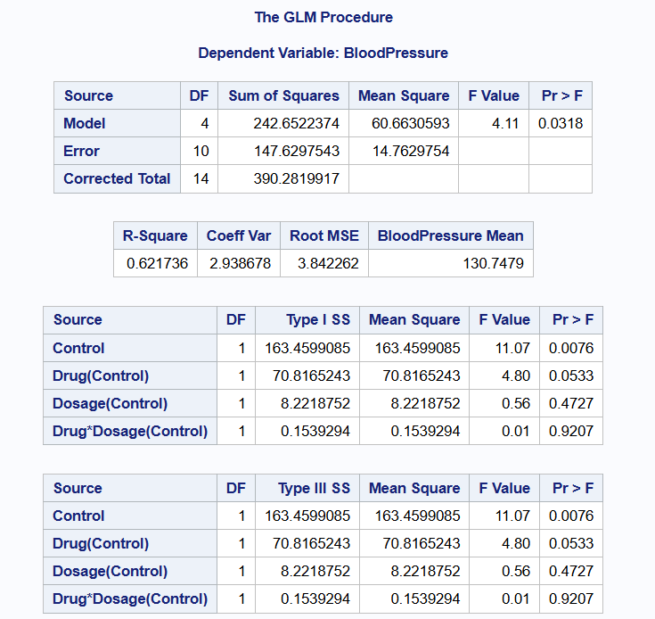
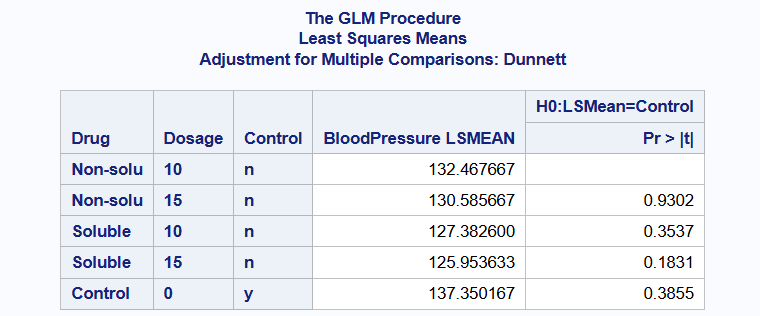

## **Introduction**

### **Exploring a 2 by 2 Factorial with Control: A Case Study**

Factorial experiments are widely used in scientific research for evaluating the interaction effects of multiple factors simultaneously. A 2 × 2 factorial design involves two factors, each at two levels, resulting in four treatment combinations. However, in many practical scenarios, researchers wish to compare these treatments not only among themselves but also against a standard or baseline treatment referred to as a control. In such cases, a 2 × 2 factorial design plus a control is adopted. There is an important difference between the traditional factorial design with a control and a 2 by 2 factorial design plus control. With the traditional factorial design with a control, we see all possible combinations of the factor levels including the control. With a factorial design plus a control, we only see possible combinations of treatments and their factor levels and control is used as a reference or considered the fifth treatment. We illustrate more of this concept using the example below.

### **Design Structure**

#### **Traditional 2 × 2 Factorial Design**

In a traditional 2 × 2 factorial design, we have:

1.  Factor A (e.g., Fertilizer type): Level A1 and A2

2.  Factor B (e.g., Irrigation regime): Level B1 and B2 This gives us four treatment combinations:

3.  A1B1

4.  A1B2

5.  A2B1

\newpage

A2B2 All these combinations are part of the factorial structure. If a control treatment (e.g., no fertilizer and no irrigation) is included, it is often embedded into one of the treatment combinations (e.g., A1B1) or replicated in all combinations as a baseline within each cell.

#### **2 × 2 Factorial Plus Control**

In a factorial plus control design:

1.  The control treatment is treated as a fifth, independent treatment, outside the factorial structure.

2.  The four factorial combinations remain the same (A1B1, A1B2, A2B1, A2B2).

3.  The control (C) is not associated with any levels of Factor A or B and is treated as its own level in the analysis.

Thus, there are 5 treatment groups in total: the four factorial combinations + 1 control.

A factorial design with control may be utilized in experiments where new drugs and methods are being tested for the first time or in new areas of study. In the case where treatments or methods are being tested for the first time, researchers may be interested in comparing the main effects of treatments with control, or in situations where they may be a significant interaction effect, compare each treatment with the control. In our example, we will compare each treatment with the control.

#### **Example**

Researchers are interested in evaluating the effect of two drugs on blood pressure. They would like to determine if a soluble or non-soluble form makes a difference. Another variable the affects performance of the drug is dosage (10 units and 15 units). Because this is a new study, they also chose a control group (No drug) to serve as reference. There were 3 replicates for each treatment combination and 3 people in the control group. A table showing the layout of the study is shown below.

\newpage

#### Interpretation of Code

The data.frame function in R creates a data frame with variables Drug Type, Dosage, Description and Replicates. The print function then prints out the table.

::: panel-tabset
## R Code

```{r}
# Create the data frame
layout <- data.frame(
  Drug_Type = c("Soluble", "Soluble", "Non-soluble", "Non-soluble", "No Drug"),
  Dosage = c(10, 15, 10, 15, 0),
  Description = c("Treatment A1B1", "Treatment A1B2", "Treatment A2B1", "Treatment A2B2", "Control"),
  Replicates = rep(3, 5)
)

# Display the data frame
print(layout)
```
:::

Data was simulated from the normal distribution with mean of zero and variance of 5. Also, data was simulated for the Control. The table above shows the treatments, Drug and Dosage, and the control. The function set.seed() is used to store our simulated data. This is very useful for reproducibility. \newpage

::: panel-tabset
## R Code

```{r}
## Storing the simulated data
set.seed(2025)

# Define levels
drug_type <- c("Soluble", "Non-soluble")
dosage <- c(10, 15)
replicates <- 3

# Generate factorial combinations
factorial_df <- expand.grid(Drug = drug_type, Dosage = dosage)
factorial_df <- factorial_df[rep(1:nrow(factorial_df), each = replicates), ]

# Simulate blood pressure (response variable)
factorial_df$BloodPressure <- with(factorial_df,
                                   130 -                           
                                     ifelse(Drug == "Soluble", 5, 0) +       
                                     ifelse(Dosage == 15, 3, 0) +            
                                     ifelse(Drug == "Soluble" & Dosage == 15, -2, 0) +  
                                     rnorm(nrow(factorial_df), mean = 0, sd = 5)        
)

# Add Control group
control_df <- data.frame(
  Drug = "control",
  Dosage = 0,
  BloodPressure = rnorm(replicates, mean = 135, sd = 5)
)

bp_data <- rbind(factorial_df, control_df)

# Convert to factors
bp_data$Drug <- as.factor(bp_data$Drug)
bp_data$Dosage <- as.factor(bp_data$Dosage)

# the library dplyr allows us to manipulate variables in data frame
library(dplyr)
bp_data <- bp_data %>%
  mutate(Control = ifelse( Dosage== 0, "y", "n"))
bp_data$Control <- as.factor(bp_data$Control)
print(bp_data)

```

## SAS Code

``` sas
data DrugData;
    input Drug $ Dosage BloodPressure Control $;
    datalines;
Soluble 10 128.1038 n
Soluble 10 125.1782 n
Soluble 10 128.8658 n
Non-soluble 10 136.3624 n
Non-soluble 10 131.8549 n
Non-soluble 10 129.1857 n
Soluble 15 127.9856 n
Soluble 15 125.6001 n
Soluble 15 124.2752 n
Non-soluble 15 136.5108 n
Non-soluble 15 131.0215 n
Non-soluble 15 124.2247 n
Control 0 132.8952 y
Control 0 138.8245 y
Control 0 140.3308 y
;
run;

proc print data=drugdata;
run;
```


:::

To set up a factorial design with control in R, one must set up the treatment combination as usual and only add the control as an additional factor. In our case, we first set up a 2 × 2 factorial design with the 2 levels in each factor using the expand.grind function and simulated the data. We then simulated the data for the control with the same standard deviation but different mean. We used the row-bind (rbind()) function to combine the two data frames.

A factorial with control design will require a variable that indicates whether a treatment is a control or not. Thus, in the final data frame, we see another variable called Control with entries "y" or "n". Where "y" indicates the presence of control and "n" otherwise.

We equally obtain the same results with the corresponding SAS code with the data function which creates the data frame. The input function in SAS allows us to create the number of variables as demonstrated in the R code. In SAS, we use \$ sign after each variable to illustrate that it is categorical. We then use proc print function to print the data frame.

\newpage

### Statistical Challenge

A lot of experiments, usually groundbreaking, take one form or shape like this experiment when a control is introduced as reference or baseline. The challenge is that a lot of researchers do not understand the difference between factorial design plus control and the traditional factorial design. Thereby analyzing such experiments as the latter. Such analysis is incorrect and only leads to wrong conclusions or inference. We demonstrate this point of view in the subsequent sections where we analyze data using the traditional factorial design and compare it to the factorial plus control design.

### Exploratory Data Analysis

As with every data analysis, we conduct an exploratory data analysis to understand some characteristics of the data. We only present information that will be useful to the reader and researcher when using this design. We show the boxplot for the control and all other treatments. The boxplot shows the average blood pressure for control and all other treatment combinations using the geom_boxplot function in the library ggplot2 package. The library ggplot2 allows us to make some many nice and informative plots in R.

From the boxplot, we see those participants in the control have on average the highest blood pressure while the soluble drug at a dose of 15 units has the lowest average blood pressure.

::: panel-tabset
## R Code

```{r}
# Load ggplot2 for boxplot
# Load dplyr to access elements in the data frame
library(ggplot2)
library(dplyr)


# Considering Species and Treatment
ggplot(bp_data, aes(x = Drug, y = BloodPressure, fill = Drug)) +
  geom_boxplot() +
  facet_wrap(~ Dosage) +
  labs(title = "Blood Pressure of Dosage and Drug Type") +
  theme_minimal()
```

## SAS Code

``` sas
proc sgplot data=DrugData;
    vbox BloodPressure / category=Drug group=Dosage;
    yaxis grid;
run;
```


:::

\newpage

Lastly, we also showed an interaction plot. From this plot, we see parallel lines which show there is no interaction between the two factors. Nevertheless, upon reading from a paper on a factorial design plus a control.

For a Completely Randomized Design, the control group is used as reference to all treatment combinations. For a Randomized Complete Block Design, one may need a control group in each block. For example, if we considered clinics as blocks, then there may be a control group in each clinic.

::: panel-tabset
## R Code

```{r}
bp_data_sub <- subset(bp_data, Drug != "Control")

# Base R interaction plot
interaction.plot(
  x.factor = bp_data_sub$Drug,
  trace.factor = bp_data_sub$Dosage,
  response = bp_data_sub$BloodPressure,
  type = "b",
  col = c("blue", "red"),
  lty = 1,
  lwd = 2,
  pch = 16,
  ylab = "Average Blood Pressure",
  xlab = "Drug",
  trace.label = "Dosage",
  main = "Interaction Plot of Drug and Dosage (with Control Reference)"
)

# Add control mean line
abline(h = mean(bp_data$BloodPressure[bp_data$Drug == "Control"]),
       col = "darkgreen", lty = 2, lwd = 2)

legend("topleft", legend = "Control Mean", col = "darkgreen", lty = 2, lwd = 2, bty = "n")
```

## SAS Code

``` sas
data bp_plot;
    set bp_data;
    if Drug ^= "Control";
run;

/* Compute mean BloodPressure for Drug × Dosage */
proc means data=bp_plot noprint;
    class Drug Dosage;
    var BloodPressure;
    output out=means_plot mean=MeanBP;
run;

/* Remove _TYPE_ and _FREQ_ rows from PROC MEANS */
data means_plot_clean;
    set means_plot;
    if _TYPE_ = 3; /* Keeps only Drug × Dosage combos */
run;

/* Get Control mean */
proc means data=bp_data noprint;
    where Drug = "Control";
    var BloodPressure;
    output out=control_mean mean=ControlMean;
run;

/* Add ControlMean to all rows for plotting */
data plot_ready;
    if _n_ = 1 then set control_mean;
    set means_plot_clean;
run;

/* Interaction Plot with Control Mean Line */
proc sgplot data=plot_ready;
    series x=Drug y=MeanBP / group=Dosage lineattrs=(thickness=2) markers;
    refline ControlMean / axis=y lineattrs=(color=darkgreen pattern=shortdash thickness=2) label="Control Mean";
    yaxis label="Average Blood Pressure";
    xaxis label="Drug";
    keylegend / location=inside position=topright across=1;
    title "Interaction Plot of Drug and Dosage (with Control Reference)";
run;
```


:::

\newpage

### Model

The linear model for a factorial design with control is given as;

$y_{ijk} = \mu + \tau_{ik} + D_{jk} + control_{k} + \epsilon_{ijk}$

where,

$y_{ijk}$ is the blood pressure of the kth individual using the ith drug type at the jth dose

$\mu$ is the intercept

$\tau_{ik}$ is the effect from the ith drug type nested in the Control

$D_{jk}$ is the effect from the jth dose level nested in the control

$control_{k}$ is the control

$\epsilon_{ijk}$ is the residual, $\epsilon_{ijk}~ N(0,\sigma^{2})$

### **ANOVA -- General Structure**

Consider a simple experiment with 2 factors, factors A and B, each with a and b levels respectively plus a control. Then the ANOVA table will look like the table below.

### **Data Analysis and Results in R**

We first look at the ANOVA table when the data is analyzed as a 2 by 2 factorial design. Note that, analyzing the experiment in this manner is incorrect. Looking at the table below, we see that there is a significant effect of dosage, p-value = 0.02112. This is because the control is embedded in dosage and thus the estimated mean for dosage includes that of control. Moreover, the degrees of freedom provided by the traditional approach for this data is incorrect. If we decide to use the traditional model, we should have 2 degrees of freedom for drug type and dosage respectively. Nevertheless, the degrees of freedom for dosage is 1, which is incorrect. With this result, a researcher may believe that dosage of the drug was significant and may continue to explore which dosage led to the highest effect.

When we take a look at the correct model, we see that the p-value for the control is statistically significant, $p-value = 0.00765$. Nevertheless, all other factors are not statistically significant including the interaction term. This is also supported by the parallel lines that we see with the interaction plot.

::: panel-tabset
## R Code

```{r}
# Model and Analysis
# Load necessary packages
library(lme4)
library(emmeans)
library(multcomp)

# Analyzing as a traditional 2 by 2 factorial
bp.m0 <- lm(BloodPressure ~ Dosage + Drug + Drug*Dosage, data = bp_data)
#summary(bp.m0)
anova(bp.m0)

bp.m0.emmeans<- emmeans (bp.m0,  ~ Drug | Dosage)
bp.m0.emmeans
```

## R Code

```{r}
# Analyzing as a traditional 2 by 2 factorial with Control
bp.m1 <- lm(BloodPressure ~ Control + Dosage + Drug + Drug*Dosage, data = bp_data)
#summary(bp.m1)
anova(bp.m1)

bp.m1.emmeans<- emmeans (bp.m1,  ~ Drug | Dosage)
bp.m1.emmeans
```
:::

\newpage

For a simple factorial plus a control like the example above, we seek to do these:

1.  Determine whether there is a significant interaction between two treatments factors

2.  Compare treatment to the control

3.  Compare treatment to each other

We first show the Anova table for this model. The table shows all sources of variation, degrees of freedom, sum of squares, f-values and p-values. We see a significant difference between control and other treatments, p-value = 0.00765. We also see a marginal significance in effect for drug but no significant interaction effect between Drug and Dosage, p-values 0.05332 and 0.92069 respectively. These values correspond to the interaction plot we saw earlier. Since there is no significant interaction effect, we can look at the main effects for Drug (soluble or non-soluble) to determine if there is any significant difference.

Lastly, we present the table for the estimated marginal means which shows the marginal means, standard errors and confidence intervals. From the ANOVA table, we saw that Drug was marginally significant. Therefore, we would write some contrast to determine if there is a significant difference between soluble and non-soluble drugs.

From the table below, there is no significant difference in effect between soluble and non-soluble drug and between non-soluble drug and control, p-values are 0.1213 and 0.1304 respectively at 5% significance level. Nevertheless, there is a significant difference in effect between soluble drug and the control group, p-value = 0.0072.

\newpage

::: panel-tabset
## R Code

```{r}
# Model with separate control effect
bp.m1 <- lm(BloodPressure ~ Control + Dosage + Drug + Drug*Dosage, data = bp_data)
summary(bp.m1)
anova(bp.m1)

```

## R Code

```{r}
## loading package for estimated marginal means 
library(emmeans)
## Getting the estimates
bp.m1.emmeans<- emmeans (bp.m1,  ~ Drug*Dosage | Control)
bp.m1.emmeans
em_drug <- emmeans(bp.m1, ~ Drug*Dosage)
em_drug

```

```{r}
# Compare each treatment with each other and the control
contrast(em_drug, method = "trt.vs.ctrl", adjust = "dunnett")
# Compare treatments excluding control
contrast(bp.m1.emmeans, method = "pairwise")
 

```

## SAS Code

``` sas
proc glm data=bp_data;
    class Control Drug Dosage;
    model BloodPressure = Control Drug(Control) Dosage(Control) Drug*Dosage(Control);
    lsmeans Drug(Control) Drug*Dosage(Control)/ pdiff=all adjust=dunnett; 
run;
```



## Estimated Marginal Means

``` sas
proc glm data=bp_data;
    class Control Drug Dosage;
    model BloodPressure = Control Drug(Control) Dosage(Control) Drug*Dosage(Control);
    lsmeans Drug(Control) Drug*Dosage(Control)/ pdiff=all adjust=dunnett; 
run;
```


:::

### **Interpretation**

In summary, the above example and results show that without any drug, blood pressure will be high on average.That is, there is a significant difference in effect between control and treatments. Nevertheless, we cannot tell based on the simulated data that a soluble drug may reduce blood pressure better than a non-soluble drug. Moreover, we cannot tell whether increasing the dosage from 10 units to 15 units will decrease blood pressure.

### **Conclusion**

The above example illustrates the benefits of designing an experiment in this form. This design allowed researchers to answer some important questions which are usually present in studies that may be groundbreaking or there may not be enough research already done in that field.
