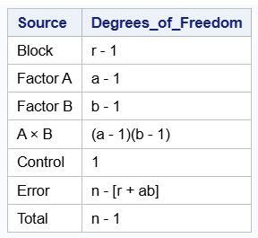
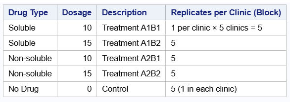
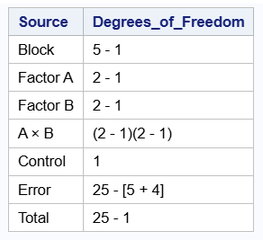
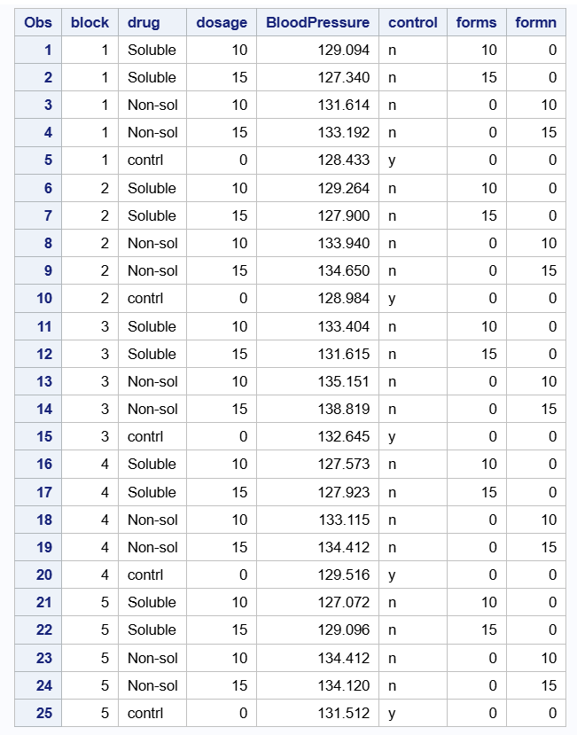
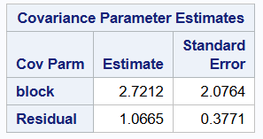
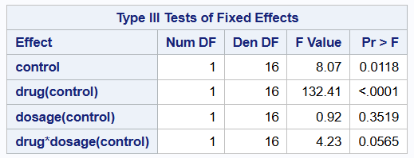
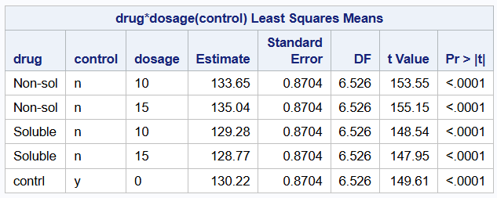
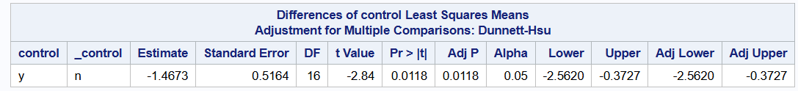
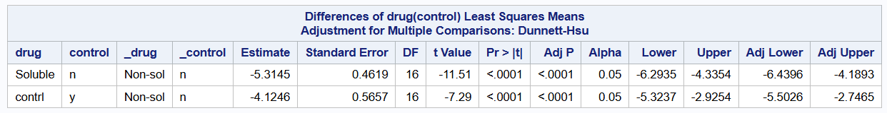
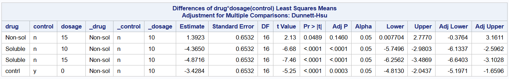

\newpage

## **Introduction**

Factorial experiments are widely used in scientific research for evaluating the effects of multiple factors simultaneously. The simplest form of the factorial design is a 2 × 2 factorial design which involves two factors. For each factor we have two levels, resulting in four treatment combinations. However, in many practical scenarios, researchers may wish to compare these treatments not only among themselves but also against a standard or baseline treatment referred to as a control. In such cases, a 2 × 2 factorial design plus a control is adopted. There is an important difference between the traditional factorial design with a control and the problem which we attempt to address in this chapter. With the traditional factorial design with a control, we see all possible combinations of the factor levels including the control. For example, we may consider an experiment with two factors, type of fertilizer and irrigation each with two levels respectively. In this scenario, A and B are the levels of fertilizer types and the levels of irrigation are Yes and No, where the latter is a control. Then for a traditional 2 × 2 factorial design with control, we would have all possible combinations: (A, Yes), (A, No), (B, Yes) and (B, No). Nevertheless, the type of problems that we try to address in this chapter involves a 2 × 2 factorial design where the control serves as the fifth treatment. We begin this chapter with a detailed discussion of a 2 × 2 factorial design plus control as the fifth treatment and extend our discussion to a 2 × 2 factorial design plus control and blocks for a better understanding of our readers.

In this chapter, we illustrate the concept of a 2 × 2 factorial design plus control, where the control is considered as the fifth treatment using the example below. Researchers are interested in evaluating the effects of two drugs on blood pressure. They would like to determine if a Soluble or Non-soluble form makes a difference. Another factor that affects performance of the drug is dosage (10 units and 15 units). Because this is a new study, they also chose a control group to serve as reference. In this experiment, the control group refers to experimental units that did not receive any of the treatments.

A 2 × 2 factorial design plus control may also be utilized in experiments where methods are being tested for the first time or in new areas of study. In the case where methods are being tested for the first time, researchers may be interested in comparing the main effects of treatments with control. In the example we consider, we are interested in determining if the treatments are able to reduce blood pressure at all. In such instances, the control group serves as a baseline and enables us to answer such a question. That is, if we find out that the blood pressure of individuals taking any of the drugs at different concentrations are on average lower than those in the control group, then we know that taking a drug is at least better than taking nothing at all. Also, in situations where there may be a significant interaction effect, we can compare each treatment combination with the control.

## Statistical Challenge

As we stated in the introduction, with a 2 × 2 factorial design plus a control, the control is considered as the fifth treatment and does not appear in any other treatment combination unlike the traditional 2 × 2 factorial design with control.

The statistical challenge is that the control is not part of the factorial structure and thus, it creates a non-orthogonal or partially unbalanced design. This is a problem because the control does not contribute to the estimation of the main effects and interaction effects of factors. Nevertheless, the control shares the same experimental error term with the treatments. When the traditional 2 × 2 factorial design is used to analyze these kinds of experiments, the implication is that the control contributes to the marginal means and also, both main effects and interactions are interpretable and balanced. This is incorrect.

The 2 × 2 factorial design plus control enables the mean of the control to be estimated separately and computes factorial means only from the four factorial cells. Moreover, the variance of factorial effects are estimated only from factorial units and thus, control observations do not influence variance.

## Exploratory Data Analysis

In our example used to demonstrate the ideas in this chapter, we first conduct an exploratory data analysis to understand how data were generated, the type and description of the variables. We only present information that will be useful to the reader when using this design. We show the histogram which gives us information about the distribution of the response. We also show the interaction plot and boxplot for all treatment combinations and the control.

Recall, the objective of the study is to evaluate the effects of two drugs on blood pressure. They would like to determine if a Soluble or Non-soluble form makes a difference. Another factor that affects performance of the drug is dosage (10 units and 15 units).

### Data Description

Data were simulated from the normal distribution with mean of $0$ and variance of $5$. To set up the 2 × 2 factorial design plus control in R, we first set up the treatment combination of drug type and dosage as a traditional factorial design and only add the control as an additional factor.

Table 1 shows the simulated data with a total of 15 observations, with three replicates from each treatment combination and the control. Both drug type (Soluble and Non-soluble) and dosage (10 units and 15 units) were considered as qualitative variables. The response variable in this experiment was blood pressure. Each individual in this experiment was considered as an experimental unit.


::: {#tbl-control-layout}


Simulated Data

:::

\newpage

Figure 1 shows the relative frequency density plot which displays the distribution of blood pressure measurements in the data. The x-axis represents blood pressure values, while the y-axis shows relative frequency density, meaning the total area under the bars sums to one. Most observations are concentrated between approximately $124$ and $136$, indicating this range contains the highest relative density of measurements. The distribution shows moderate spread, with fewer observations at the higher end near 140 mmHg, suggesting slight right-skewness. No extreme outliers are apparent, although the density decreases toward the upper tail. Overall, the plot suggests that blood pressure values are clustered around the mid-120s to mid-130s, with relatively low variability outside this range.

\newpage

``` sas
/*----- The code chunk below creates a histogram ----*/

proc sgplot data=bpdata;
    histogram BloodPressure;
run;
```


\newpage

Figure 2 displays the boxplot of blood pressure across different drug types, including soluble, non-soluble, and control groups, at three dosage levels: 0, 10, and 15 units. At dosage 0, only the control group is represented. In the simulated data, this group shows the highest median blood pressure, with values centered around the upper 130s and relatively low variability. This pattern reflects the baseline blood pressure distribution generated for the control condition in the absence of a simulated drug dosage.

At dosage 10, the simulated soluble and non-soluble drug groups show lower median blood pressure values compared with the control group at dosage 0. The soluble drug group has the lowest median blood pressure and a relatively narrow interquartile range, indicating more consistent simulated responses. In contrast, the non-soluble drug group shows a higher median and greater variability, suggesting that the simulated responses for this group were more spread out.

At dosage 15, the simulated soluble drug group continues to show the lowest median blood pressure with minimal variability. This indicates that, within the simulated dataset, the soluble drug condition was generated to have a stronger and more consistent reduction in blood pressure. The non-soluble drug group again shows higher median values and a wider spread, with observations extending across a broader range, reflecting greater variability in the simulated response.


``` sas
/*----- The code chunk below creates a boxplot ----*/

proc sgplot data=bpdata;
    vbox BloodPressure / category=drug group=dosage;
    yaxis grid;
run;
```


\newpage

Figure 3 shows the interaction plot for drug type and dosage. The data for this example was generated to have no interaction and thus, we show this for completeness. The absence of an interaction for a 2 × 2 factorial design is usually illustrated by parallel lines. From the interaction plot shown in Figure 3, we see parallel lines which shows there is no interaction between the two factors.

This implies that the effect of one factor, say drug type on blood pressure, is the same at all levels of dosage. Thus, the two factors are independent of each other. Nevertheless, we need to look at the ANOVA table.

``` sas

/*----- Code chunk showing interaction plot ----*/

data bp_plot;
    set bpdata;
    if drug ^= "contrl";
run;

/*---Code chunk to compute mean BloodPressure for Drug × Dosage--- */

proc means data=bp_plot noprint;
    class drug dosage;
    var BloodPressure;
    output out=means_plot mean=MeanBP;
run;

/*---- Remove _TYPE_ and _FREQ_ rows from PROC MEANS ----*/

data means_plot_clean;
    set means_plot;
    if _TYPE_ = 3; /* Keeps only Drug × Dosage combos */
run;

/*---- Get Control mean ----*/

proc means data=bpdata noprint;
    where drug = "contrl";
    var BloodPressure;
    output out=control_mean mean=ControlMean;
run;

/*----- Add ControlMean to all rows for plotting -----*/

data plot_ready;
    if _n_ = 1 then set control_mean;
    set means_plot_clean;
run;

/*---- Interaction Plot with Control Mean Line -----*/

proc sgplot data=plot_ready;
    series x=drug y=MeanBP 
      / group=dosage lineattrs=(thickness=2) markers;
    refline ControlMean 
      / axis=y lineattrs=(color=darkgreen pattern=shortdash thickness=2)
      label="Control Mean";
    yaxis label="Average Blood Pressure";
    xaxis label="drug";
    keylegend / location=inside position=topright across=1;
    title "Interaction Plot of Drug and Dosage (with Control Reference)";
run;
```


\newpage

## Advanced Analysis

Recall, the main objective of the experiment is to understand how drug type and dosage levels affect blood pressure and also how the treatments perform in comparison to the control. Thus, we seek to answer two important questions with a single model.

The statistical model thus seek to evaluate whether average blood pressure of individuals taking a soluble drug differs from the blood pressure of individuals with non-soluble drug. Moreover, the model enables us to compare average blood pressure when a treatment was administered to that of the control group who did not receive any treatment all.

Similarly, we are able to evaluate the effect of the dosage levels and compare their effect on blood pressure. In this chapter, we consider a simple linear model with assumption that blood pressure is independent and identically distributed and that we have homogeneous variance.


### Statistical Model

The linear model for a factorial design plus control is given as

$$ 
y_{ijkl} = \mu + \alpha_i + \beta_j + (\alpha \beta)_{ij} + \gamma I_k +\varepsilon_{ijkl}
$$

with,

$$
I_k =
\begin{cases}
1 & \text{if the observation belongs to the control treatment} \\
0 & \text{if the observation belongs to one of the factorial treatments},
\end{cases}
$$

for $i= 1,2$, $j= 1,2,3$ and $k= 0,1$, where:

$y_{ijkl}$ is the blood pressure of the $lth$ individual using the $ith$ type of drug at the $jth$ dose, \newline

$\mu$ represents the baseline mean of the factorial treatments, \newline

$\alpha_i$ is the effect of the $ith$ drug type, \newline

$\beta_j$ is the effect of the $jth$ dosage, \newline

$(\alpha\beta)_{ij}$ is their interaction effect, \newline

$\gamma$ measures the difference between the control treatment and the factorial baseline, and \newline

$\varepsilon_{ijkl}$ are assumed to be independently and normally distributed with mean zero and constant variance $\sigma^2$. \newline


``` sas
/*----- Code chunk showing the traditional factorial design ------*/

proc glimmix data = bpdata1; 
class drug dosage;
model BloodPressure = drug dosage 
  drug*dosage / solution ddfm=kr;  
lsmeans drug dosage drug*dosage;
run;
```

::: {#tbl-control-layout}


ANOVA Table (Incorrect Model)

:::

Table 2 shows the ANOVA table when the data are analyzed as a traditional 2 by 2 factorial design. Note that analyzing the experiment in this manner is incorrect. Looking at Figure 2, we see that there is a significant effect of dosage with p-value = $0.02$. This is because the control is embedded in dosage and thus the estimated mean for dosage includes that of control. With this result, a researcher may believe that dosage of the drug was significant and may continue to explore which dosage led to the highest effect.

\newpage

``` sas

/*----- Code chunk showing the factorial design plus control ------*/

proc glimmix data = bpdata; 
class drug dosage control;
model BloodPressure =  control drug(control) dosage(control)
  drug*dosage(control)/solution ddfm=kr;  
lsmeans control drug(control) dosage(control);
run;
```

::: {#tbl-control-layout}


ANOVA Table (Correct Model)

:::

Table 3 takes a look at the correct model. From Table 3, we see that the p-value for the control shown in the ANOVA table is statistically significant, p-value = $0.01$ and the p-value for dosage by drug interaction term is $0.92$. These values correspond to the interaction plot we saw earlier. Since there is no significant interaction effect, we can look at the main effects for Drug (soluble or non-soluble) to determine if there is any significant difference.


We proceed with further analysis by looking at the main and simple effects of only the correct model. Table 4 shows the estimated marginal means for drug type. For drug type soluble and non-soluble, the estimated marginal means are $127$ and $132$ respectively with standard error $1.57$. The estimated mean for the control group is $137$ with standard error of $2.22$. The 95 percent confidence intervals are also shown in the last two columns of the same table.

``` sas

/*---- lsmeans statement to obtain estimated marginal means----*/

lsmeans drug(control) / diff= control adjust=dunnett cl;
run;
```

::: {#tbl-control-layout}


Main effects of drug type

:::

\newpage

Table 5 shows the estimated marginal means for dosage. When dosage levels are at 10 and 15 units, the estimated marginal means are $130$ and $128$ respectively with standard error $1.57$. The estimated mean for the control group is again $137$ with standard error of $2.22$ indicating that the control group did not receive any treatment.

``` sas

/*---- lsmeans statement to obtain estimated marginal means ----*/

lsmeans dosage(control) / diff= control adjust=dunnett cl;
run;
```
::: {#tbl-temp5-layout}


Main effects of dosage

::: 

\newpage

### Simple Effects

Next, we show the simple effects of drug and dosage. A simple effect refers to the effect of one treatment factor at a specific level of another factor. One typically would need to look at simple effects if there is a significant interaction effect. It is used in factorial experiments to understand how factors interact. In our example, there was no significant interaction effect but we show the results here for completeness.

From Table 6, the simple effect for dosage at 10 and 15 units when a soluble drug is used are $127$ and $126$ respectively. For non-soluble drug, the simple effect of dosage at 10 and 15 units are $132$ and $131$ respectively. Looking at the simple effects, we see a lower blood pressure when the drug is soluble. Nevertheless, without any drug or dosage, the blood pressure is high.

``` sas
/*--- Code chunk showing the simple effect of
treatments excluding control ---*/
/*---- lsmeans statement to obtain estimated marginal means ----*/

lsmeans dosage*drug(control) / diff= control adjust=dunnett cl;
run;
```

::: {#tbl-temp6-layout}


Simple effects of drug type

::: 

The same results are obtained when we find the simple effect of drug type at given dosage levels. At dosage level of 10 units, the simple effect for soluble and non-soluble drugs are $127$ and $132$ respectively. While at a dosage level of 15 units, the simple effects of soluble and non-soluble drugs are $126$ and $131$ respectively.

\newpage

Recall, the 2 × 2 factorial design plus control enables us to also compare the main effect of treatments to the control group. This is possible because of the variable control in the last column of the data set. It serves as an indicator variable and thus enables the model to average over the values of the treatments and compare them to the control group. From Results 1, we see that on average the estimated blood pressure for individuals receiving a treatment compared to control group was $129$ and $137$ respectively. Thus, the blood pressure for individuals in the control group is higher on average compared to individuals who receive some type of treatment. The difference between the two values is shown by the contrast statement. From output 1, we see that the difference is $8.25$ and with a standard deviation of $2.48$. The p-value is $0.01$, showing that there is a statistically significant difference between individuals that received some sort of treatment and the control group at $\alpha = 0.05$.

``` sas
/*--- Code chunk showing the main effect of treatment and control ---*/

lsmeans control / diff= control adjust=dunnett cl;
run;
```
::: {#tbl-temp7-layout}


Main effect of treatments and control

:::

``` sas
/*--- Code chunk showing difference in
main effect of treatment and control ---*/

lsmeans control / diff= control adjust=dunnett cl;
run;
```
::: {#tbl-temp8-layout}


Difference of treatment main effect and control

::: 

Finally, Table 10 shows differences drug type. This is obtained by writing contrast statements. Writing contrasts is very useful especially when there are many treatments and we may only be interested in a few comparisons. Therefore, we would write some contrast to determine if there is a significant difference between soluble and non-soluble drugs, soluble and control, non-soluble and control. We used the Dunnett adjustment to control for family-wise error.

From Table 10, there is no significant difference in effect between soluble and non-soluble drug and between non-soluble drug and control, p-values are $0.13$ and $0.14$ respectively at $5$ percent significance level. Nevertheless, there is a significant difference in effect between soluble drug and the control group, p-value = $0.01$.

``` sas
/*--- Code chunk showing differences of drug type
and dosage ---*/

lsmeans control drug(control) dosage(control)
drug*dosage(control)/ diff= control adjust=dunnett cl;
run;
```
::: {#tbl-temp9-layout}

 

Differences of drug type and dosage least square means

::: 

\newpage

We extend the discussion of a 2 × 2 factorial design plus control to a 2 × 2 factorial design plus control and blocks which is the main focus of this chapter. Recall, earlier the control was treated as a fifth treatment outside the factorial structure. That is, the four factorial combinations were formed from two factors, each with two levels, while the control treatment served as a separate reference group.

When blocks are added to this design, treatments are randomized within each block. This produces a randomized complete block design (RCBD), where each block contains all four factorial treatment combinations and the control. The main purpose of including blocks is to account for variability among groups of experimental units that may be similar within blocks but different across blocks. We consider a second example where clinics serve as blocks because patients within the same clinic may be more alike than patients from different clinics.

For a 2 × 2 factorial design plus control and blocks, the analysis allows researchers to control for block-to-block variation, compare the factorial treatments with the control, estimate the main effects of the two factors, and evaluate the interaction between the factors within the factorial portion of the design. The control remains outside the factorial treatment structure and is used as a baseline for comparison.

Moreover, the addition of blocks introduces another source of variation. In this example, clinics may differ from one another because of differences in patient populations, clinic procedures, or other background conditions. If block effects are ignored, some of this block-to-block variation may be absorbed into the residual error term, which can affect the precision of the estimated treatment effects. Thus, the correct analysis must separate the control from the factorial treatment combinations while also accounting for block variation.

## Exploratory Data Analysis

For the second example considered, we also simulated a data set to demonstrate a 2 × 2 factorial design plus control and blocks. The study evaluates the effects of two drug-related factors on blood pressure. The first factor is drug type, with two levels: soluble and non-soluble. The second factor is dosage, with two levels: 10 units and 15 units. A control group is included to represent patients who did not receive either treatment.

The experiment is conducted in five clinics. Each clinic is treated as a block, and each clinic receives all five treatments: the four factorial treatment combinations and the control. The exploratory analysis describes the layout of the study, the simulated data, the distribution of blood pressure, the relationship between drug type and dosage, and the role of blocks in the analysis.

### Data Description

There are 25 observations in the simulated data set. This includes five clinics, with one observation for each treatment combination within each clinic. Therefore, each of the four factorial treatment combinations has five observations, and the control group also has five observations.

The response variable again is blood pressure. Drug type and dosage are treated as qualitative variables. The variable `Control` is used as an indicator variable, where `n` identifies observations from the factorial treatment combinations and `y` identifies observations from the control group just as discussed in the previous section. Also, we only show the data used for this example and skip plots for the exploratory data analysis. This is because the plots are similar to the ones shown in Figures 1 and 2.

Table 9 shows the general sources of variation for a 2 × 2 factorial design plus control and blocks. Compared with the previous chapter, the only additional source of variation is the block term.

::: {#tbl-control-layout}


General structure of the ANOVA for 2 by 2 factorial plus block

::: 

Table 10 shows the layout of the experiment. Each clinic contains the four factorial treatment combinations and the control exactly once.

::: {#tbl-control-layout}


General structure of experimental design

::: 

Table 11 presents the degrees of freedom for the example. There are five clinics, so the block term has 4 degrees of freedom. Drug type, dosage, their interaction, and the control indicator each have 1 degree of freedom. The remaining 16 degrees of freedom are assigned to error.

``` sas
/*--- Code chunk showing the ANOVA table ---*/

data anova_table;
    length Source $15 Degrees_of_Freedom $20;
    
    Source = "Block"; 
    Degrees_of_Freedom = "5 - 1"; 
    output;

    Source = "Factor A"; 
    Degrees_of_Freedom = "2 - 1"; 
    output;

    Source = "Factor B"; 
    Degrees_of_Freedom = "2 - 1"; 
    output;

    Source = "A × B"; 
    Degrees_of_Freedom = "(2 - 1)(2 - 1)"; 
    output;

    Source = "Control"; 
    Degrees_of_Freedom = "1"; 
    output;

    Source = "Error"; 
    Degrees_of_Freedom = "25 - [5 + 4]"; 
    output;

    Source = "Total"; 
    Degrees_of_Freedom = "25 - 1"; 
    output;
run;

proc print data=anova_table noobs;
run;
```

::: {#tbl-control-layout}


ANOVA table for 2 by 2 factorial plus control and block

:::

\newpage

Table 12 shows the simulated data. Each clinic contributes one observation for each treatment combination and one observation for the control.

::: {#tbl-control-layout}


Simulated data

::: 

\newpage

## Advanced Analysis

In this example, clinics are included as blocks but the objective of the analysis is the same as the one discussed in a 2 × 2 factorial design plus control without blocks. The model therefore contains the same factorial treatment structure and control indicator used in the previous chapter, with the addition of a block term.

### Statistical Model

The statistical model for a 2 × 2 factorial design with control and blocks is given as

$$
y_{ijkl} = \mu + b_l + \alpha_i + \beta_j + (\alpha\beta)_{ij} + \gamma I_k + \varepsilon_{ijkl},
$$

with

$$
I_k =
\begin{cases}
1 & \text{if the observation belongs to the control treatment} \\
0 & \text{if the observation belongs to one of the factorial treatments},
\end{cases}
$$

for

$y_{ijkl}$ is the blood pressure response for the experimental unit receiving the $ith$ drug type at the $jth$ dosage level in the $lth$ block,

$\mu$ represents the baseline mean of the factorial treatments,

$b_l$ is the effect of the $l$th block or clinic, assumed to be independently and normally distributed with mean 0 and variance $\sigma^2_{b}$ ,

$\alpha_i$ is the effect of the $i$th drug type,

$\beta_j$ is the effect of the $j$th dosage level,

$(\alpha\beta)_{ij}$ is the interaction effect between drug type and dosage,

$\gamma$ measures the difference between the control treatment and the factorial baseline,

$\varepsilon_{ijkl}$ is the residual error term, assumed to be independently and normally distributed with mean 0 and constant variance $\sigma^2_{\epsilon}$,

The only difference between this model and the model shown earlier is the addition of the block term, $b_l$. No block-by-treatment interaction is assumed. In the R analysis below, clinic is treated as a random block effect to estimate the amount of block-to-block variation.

\newpage

The model summary shows the estimated fixed effects and the variance components. The block variance describes how much variability is associated with differences among clinics, while the residual variance describes variation among experimental units after accounting for the model terms.

``` sas
/*--- Code chunk showing estimate for block (random) and residual ---*/

proc glimmix data = bpdata_block; 
class block drug dosage control;
model BloodPressure =  control drug(control) dosage(control)
  drug*dosage(control)/solution ddfm=kr; 
random block;
run;
```



\newpage

Table 13 presents the ANOVA table for the mixed model using the Kenward-Roger degrees-of-freedom method. The `Control` term compares the overall treatment groups with the control group. The `Control:Drug` and `Control:Dosage` terms estimate the factorial drug and dosage effects among the treatment observations. The `Control:Drug:Dosage` term evaluates the interaction between drug type and dosage within the factorial treatment structure.

\newpage

``` sas
/*--- Code chunk showing the ANOVA table ---*/

proc glimmix data = bpdata_block; 
class block drug dosage control;
model BloodPressure =  control drug(control) 
  dosage(control) drug*dosage(control)/solution ddfm=kr; 
random block;
run;
```



From Table 13, the control effect is statistically significant, which indicates evidence of a difference between the control group and the treatment groups. The drug type effect is also statistically significant, meaning that soluble and non-soluble drugs differ in their average effect on blood pressure. The dosage effect is not statistically significant. The interaction term is marginal, suggesting that the relationship between dosage and blood pressure may depend somewhat on drug type, although the evidence is not strong at the 5 percent significance level.

\newpage

Table 14 shows the estimated marginal means for each drug-by-dosage combination and for the control group. The non-soluble treatments have higher estimated blood pressure values than the soluble treatments at both dosage levels. The control mean is separate from the factorial treatment means because the control is not part of the drug-by-dosage factorial structure.

``` sas
/*--- Code chunk showing the least square means of treatments and control ---*/

proc glimmix data = bpdata_block; 
class block drug dosage control;
model BloodPressure =  control drug(control)
  dosage(control) drug*dosage(control)/solution ddfm=kr; 
lsmeans drug*dosage(control);
random block;
run;
```



\newpage

Table 15 compares the overall treatment mean with the control mean. This comparison is important because the control group serves as the baseline for determining whether receiving any treatment differs from receiving no treatment.

The contrast shows a statistically significant difference between the treatment groups and the control group. This suggests that, on average, the blood pressure response differs between individuals receiving a treatment and those in the control group.

``` sas
/*--- Code chunk showing the main effects of treatments and control ---*/

proc glimmix data = bpdata_block; 
class block drug dosage control;
model BloodPressure =  control drug(control)
  dosage(control) drug*dosage(control)/solution ddfm=kr; 
lsmeans control / diff = control adjust=dunnett cl;
random block;
run;
```



\newpage

### Simple Effects

When an interaction is present or nearly present, it is useful to examine simple effects. A simple effect compares one factor at a specific level of another factor. In this example, simple effects help determine whether soluble and non-soluble drugs differ at each dosage level and whether dosage levels differ within each drug type.

Table 16 compares the main effect of drug type within the treatment portion of the design. The comparison is shown for completeness, but when the interaction term is considered important, the simple effects should be emphasized.

``` sas
/*--- Code chunk showing difference of drug type effect ---*/

proc glimmix data = bpdata_block; 
class block drug dosage control;
model BloodPressure =  control drug(control) 
  dosage(control) drug*dosage(control)/solution ddfm=kr;
contrast 'Soluble vs Non-soluble' drug(control) 1 -1 0; 
lsmeans drug(control) / diff = control adjust=dunnett cl;
random block;
run;
```



\newpage

Table 17 compares all drug-by-dosage treatment combinations within the factorial portion of the design. These comparisons show that soluble and non-soluble drugs differ at both dosage levels. However, there is not strong evidence that increasing dosage from 10 units to 15 units changes blood pressure within the same drug type.

Because multiple comparisons increase the chance of a Type I error, the Dunnett adjustment can be used when the main interest is comparing treatments with a control. The code below applies the Dunnett adjustment to the comparisons.

``` sas
/*--- Code chunk showing differences of drug by dosage type ---*/

proc glimmix data = bpdata_block; 
class block drug dosage control;
model BloodPressure =  control drug(control)
  dosage(control) drug*dosage(control)/solution ddfm=kr; 
lsmeans drug*dosage(control) / diff = control adjust=dunnett cl;
random block;
run;
```



\newpage

## Conclusion

In this chapter, we considered the 2 × 2 factorial design with control and blocks, and how experiments of this nature can be analyzed. We first considered the case without block for easy understanding and extended the concepts to the case where blocks are considered. The first example used to illustrate the concepts in this chapter was about evaluating the effects of two drugs on blood pressure which consisted of two factors and a control group. The second example involved two drug types, two dosage levels, a control group, and five clinics treated as blocks. The purpose of including blocks in the second example was to account for variation among clinics while still comparing the factorial treatments and the control group appropriately. These designs allowed researchers to answer some important questions which are usually present in studies that may be groundbreaking or there may not be enough research already done in that field.

Overall, the 2 × 2 factorial design plus control and blocks allows researchers to separate block-to-block variation from treatment variation. More importantly, both examples also preserve the correct interpretation of the control group as a separate baseline treatment rather than forcing the control into the factorial structure.
