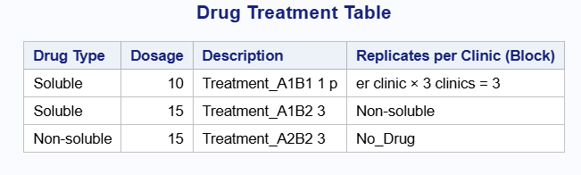
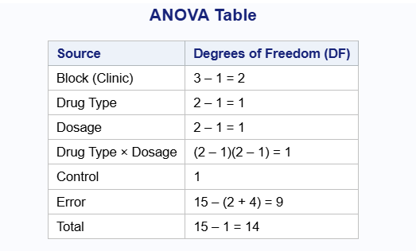
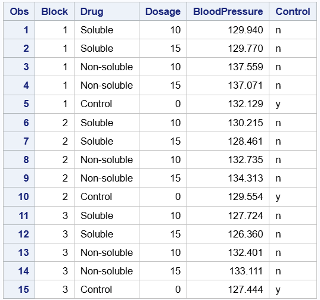

## Exploring a 2 × 2 Factorial Design With Control and Blocks: A Case Study

We extend our discussion of a 2 × 2 factorial design with control to a 2 × 2 factorial design with control and blocks. If blocks are used, treatments are randomized within each block. This results in a randomized complete block design (RCBD), where each treatment (including control if embedded) appears once per block.

Recall, in a 2 × 2 factorial design with control presented in the previous chapter, the four factorial combinations were: A1B1, A1B2, A2B1, A2B2. The control treatment (C) was treated as a fifth, independent treatment, outside the factorial combinations. It was not associated with any level of factor A or B. The control is usually included as a reference, not involved in interaction effects. For a 2 × 2 factorial with control and blocks, this allows the analysis to:

1.  Control for block-to-block variation

2.  Compare each factorial treatment to the control within and across blocks

3.  Estimate main effects and interaction effects within the factorial structure

4.  Maintain orthogonality between blocks and treatments

We present the general framework of the anova structure for this design and later illustrate with an example how to implement the techniques on a real data. The analysis of variance for a 2 × 2 factorial design with control and blocks is shown using the R and SAS codes below. The data.frame() function in R creates the data frame with source of variation and degrees of freedom. We also show the corresponding output in SAS below. The anova table presented in this chapter is similar to the one in the previous chapter. The only addition this time is the extra source of variation, which is the block and its corresponding degrees of freedom.

\newpage

::: panel-tabset
## R Code

```{r echo=TRUE, warning=FALSE}
# Define symbolic expressions or general structure of factorial with control and block
anova_table <- data.frame(
  Source = c("Block", "Factor A", "Factor B", "A × B", "Control", "Error", "Total"),
  Degrees_of_Freedom = c(
    "r - 1",
    "a - 1",
    "b - 1",
    "(a - 1)(b - 1)",
    "1",
    "n - [r + ab + 1]",
    "n - 1"
  )
)

# Print the table
print(anova_table, row.names = FALSE)

```

## SAS Code

``` sas
/* this creates the data frame */
data anova_table; 
length Source $20 Degrees_of_Freedom $30;
/* creates the columns Source and Degrees of Freedom */
input Source $20 Degrees_of_Freedom $30; 
datalines; 
    Block                  (r - 1)
    A                      (a - 1)
    B                      (b - 1)
    A_x_B                  (a - 1)(b - 1)
    Control                    1
    Error                  (n - [r + ab + 1])
    Total                  (n - 1)
;
run;

/* proc print prints the results */
proc print data=anova_table noobs; 
    title "Symbolic ANOVA Table";
run;
```


:::

\newpage

## **Example**

Researchers are interested in evaluating the effect of two drugs on blood pressure. They want to know whether the drug type (soluble vs. non-soluble) and dosage (10 units vs. 15 units) influence outcomes. A control group (placebo) is also included to serve as a baseline for comparison and the study is conducted in three clinics. Furthermore, to reduce variability arising from different clinics and other extraneous factors, the experiment is conducted as a randomized complete block design where clinics are considered as blocks.

The R code below presents a summary table which describes how the experiment was conducted, that is, the type of treatments, and replicates per clinics. We also show same results in the SAS output below.

::: panel-tabset
## R Code

```{r echo=TRUE, warning=FALSE}
# Create the data frame
drug_table <- data.frame(
  `Drug Type` = c("Soluble", "Soluble", "Non-soluble", "Non-soluble", "No Drug"),
  Dosage = c(10, 15, 10, 15, 0),
  Description = c("Treatment A1B1", "Treatment A1B2", "Treatment A2B1", "Treatment A2B2", "Control"),
  `Replicates per Clinic (Block)` = c(
    "1 per clinic × 3 clinics = 3",
    "3",
    "3",
    "3",
    "3 (1 in each clinic)"
  ),
  check.names = FALSE  # To allow special characters in column names
)

# Print the table
print(drug_table, row.names = FALSE)

```

## SAS Code

``` sas
data drug_table;
    length 
        Drug_Type $15 
        Dosage 8 
        Description $20 
        Replicates_per_Clinic_Block $40;
    input 
        Drug_Type $ 
        Dosage 
        Description $20. 
        Replicates_per_Clinic_Block & $40.;
    datalines;
Soluble       10  Treatment_A1B1  1  per clinic × 3 clinics = 3
Soluble       15  Treatment_A1B2  3
Non-soluble   10  Treatment_A2B1  3
Non-soluble   15  Treatment_A2B2  3
No_Drug        0  Control         3 (1 in each clinic)
;
run;

proc print data=drug_table noobs label;
    label 
        Drug_Type = "Drug Type"
        Replicates_per_Clinic_Block = "Replicates per Clinic (Block)";
    title "Drug Treatment Table";
run;
```


:::

\newpage

In this RCBD, each clinic receives all treatments, including the control exactly once, which are randomly assigned within the clinic. We present the anova table using both R and SAS in the code below. We see that the sources of variation are clinic, drug type, dosage, drug type × dosage, control, Error. We also show the degrees of freedom in the table below. We see from the output that the degree of freedom for clinic is 2. The degrees of freedom for drug type and dosage are 1 respectively, as well as their interaction. Lastly, the degrees of freedom for the control and error terms are 1 and 9 respectively. We use the print() to print our results as we did in the previous chapter. The same result is obtained in the SAS output.

::: panel-tabset
## R Code

```{r echo=TRUE, warning=FALSE}
# Create the data frame
anova_df <- data.frame(
  Source = c(
    "Block (Clinic)",
    "Drug Type",
    "Dosage",
    "Drug Type × Dosage",
    "Control",
    "Error",
    "Total"
  ),
  `Degrees of Freedom (DF)` = c(
    "3 – 1 = 2",
    "2 – 1 = 1",
    "2 – 1 = 1",
    "(2 – 1)(2 – 1) = 1",
    "1",
    "15 – (2 + 4) = 9",
    "15 – 1 = 14"
  ),
  check.names = FALSE  # Allows special characters in column names
)

# Print the table
print(anova_df, row.names = FALSE)

```

## SAS Code

``` sas
data anova_df;
    length 
        Source $30 
        DF $25;
    input 
        Source & $30. 
        DF & $25.;
    datalines;
Block (Clinic)           3 – 1 = 2
Drug Type                2 – 1 = 1
Dosage                   2 – 1 = 1
Drug Type × Dosage       (2 – 1)(2 – 1) = 1
Control                  1
Error                    15 – (2 + 4) = 9
Total                    15 – 1 = 14
;
run;

proc print data=anova_df noobs label;
    label 
        Source = "Source"
        DF = "Degrees of Freedom (DF)";
    title "ANOVA Table";
run;
```


:::

\newpage

## **Model**

Next, we present the statistical model for the design above. The model below is similar to the model in chapter 1. In this model, we include the block term. Note that we do not assume block by interaction in this model. Also, blocks are considered fixed.

$y_{ijk} = \mu + \beta_{i} + \tau_{jl} + \delta_{kl} + \tau\delta_{jkl} + control_{l} + \epsilon_{ijkl}$

where,

$y_{ijk}$ is the blood pressure of the kth individual using the ith drug type at the jth dose

$\mu$ is the intercept

$\beta_{i}$ is the effect from the ith block, block is considered fixed

$\tau_{jl}$ is the effect from the jth drug type nested in the Control

$\delta_{kl}$ is the effect from the kth dose level nested in the control

$\tau\delta_{jkl}$ is the interaction between drug type and dosage level in the Control

$control_{l}$ is the control

$\epsilon_{ijkl}$ is the residual, $\epsilon_{ijkl}$ \~ $N(0,\sigma^{2})$

\newpage

Recall, for a 2 × 2 factorial design with a control, we created a control variable that nests the treatment combination. We again create a control variable that nests the treatments and control. Where "n" indicates there is no control and "y" indicates otherwise just as we showed in chapter 1. The goal is to allow for comparison between treatments and the control. The R code below shows the data frame including the control variable. We print out the output below.

::: panel-tabset
## R Code

```{r echo=TRUE, warning=FALSE}
set.seed(123)

# Define the base structure
Block <- rep(1:3, each = 5)
Drug <- rep(c("Soluble", "Soluble", "Non-soluble", "Non-soluble", "Control"), times = 3)
Dosage <- rep(c(10, 15, 10, 15, 0), times = 3)
Control <- ifelse(Drug == "Control", "y", "n")

# Introduce block-level effects
block_effects <- c(2, 0, -2)  # Example: block 1 has higher BP, block 3 has lower

# Generate BloodPressure values with block as fixed effect
BloodPressure <- numeric(length(Block))
for (i in 1:length(Block)) {
  base <- 130  # general base level
  drug_effect <- if (Drug[i] == "Soluble") {
    if (Dosage[i] == 10) -1.5 else -2
  } else if (Drug[i] == "Non-soluble") {
    if (Dosage[i] == 10) 4 else 5
  } else {
    0  # control
  }
  BloodPressure[i] <- base + drug_effect + block_effects[Block[i]] + rnorm(1, 0, 1)
}

# Create the data frame df and treat block, drug, dosage and control as factors
df <- data.frame(Block, Drug, Dosage, BloodPressure = round(BloodPressure, 4), Control)
df$Block <- as.factor(df$Block)
df$Drug <- as.factor(df$Drug)
df$Dosage <- as.factor(df$Dosage)
df$Control <- as.factor(df$Control)
# Print the dataset
print(df)

```

## SAS Code

``` sas
data pressure;
    input Block Drug $15. Dosage BloodPressure Control $;
    datalines;
1 Soluble       10 129.9395 n
1 Soluble       15 129.7698 n
1 Non-soluble   10 137.5587 n
1 Non-soluble   15 137.0705 n
1 Control        0 132.1293 y
2 Soluble       10 130.2151 n
2 Soluble       15 128.4609 n
2 Non-soluble   10 132.7349 n
2 Non-soluble   15 134.3131 n
2 Control        0 129.5543 y
3 Soluble       10 127.7241 n
3 Soluble       15 126.3598 n
3 Non-soluble   10 132.4008 n
3 Non-soluble   15 133.1107 n
3 Control        0 127.4442 y
;
run;

proc print data=pressure;
run;
```


:::

In the R code above, we have 3 blocks with 5 replicates. This is because, for an RCBD, we have each treatment combination and a control. This means we have 5 treatments in each block overall. The SAS code and output also produces similar results.

\newpage

The explanatory analysis for this data can be seen in chapter 1 where we presented the example and data but we did not consider blocking.

The table below shows the variance components for clinic (block) and residual if clinic were to be treated as random. Looking at the table, the variance for clinic(block) is 3.615 and the variance for residual is 0.941. The block variance measures how much of the total variability in the response variable is being explained by the block.In this example, we see that a large proportion of the total variation is due to the block. The corresponding SAS output when block is considered random is shown. Nevertheless, we will consider the case where blocks are fixed and show the output only in R.

\newpage

::: panel-tabset
## R Code

```{r echo=TRUE, results='hide',warning=FALSE}
library(lme4)
library(emmeans)
# Fit linear mixed model with random block
model.random <- lmer(BloodPressure ~ Control + Drug:Control + Dosage:Control + Drug:Dosage:Control + (1|Block), data = df)
model.random
```

## SAS Code

``` sas
proc glimmix data = pressure; 
title "BloodPressure";
class Block Drug Dosage Control ;
model BloodPressure =  Control Drug(Control) Dosage(Control) Drug*Dosage(Control)/solution ddfm=kr;
lsmeans Control Drug(Control) Drug*Dosage(Control)/diff adjust=dunnett;
random Block;
run;
```


:::

\newpage

Secondly, we show the estimates of fixed effects in the output below. Nevertheless, with this type of design, such estimates can be misleading. Therefore, we do not use information from this table for inference or conclusions.

The results we get in this ANOVA table are very similar to the one we obtained previous chapter without the block. In the anova table, we see that block, control and drug are all statistically significant with p-values 0.00074, 0.0151 and 6.648e-06 respectively.

::: panel-tabset
## R Code

```{r echo=TRUE, results='hide',warning=FALSE}
library(lme4)
library(emmeans)
# Fit linear mixed model with fixed block
model.fixed <- lm(BloodPressure ~ Block + Control + Dosage + Drug + Drug*Dosage, data = df)
# Summary
summary(model.fixed)
anova(model.fixed)

```
:::

\newpage

Next, we show the estimated marginal means table also in the output below. The estimated mean for non-soluble and soluble drugs at 10 percent dosage level were 132 and 127 respectively. Also, for non-soluble and soluble drugs at 15 percent dosage, the estimated means were 131 and 126 respectively. Lastly, the estimate for control is 137, which is higher than all other treatment combinations.

::: panel-tabset
## R Code

```{r echo=TRUE, results='hide',warning=FALSE}
library(lme4)
library(emmeans)
# EMMs
emm <- emmeans(model.fixed, ~ Drug:Dosage | Control)
emm
```
:::

\newpage

We also show the main effect of treatment versus control. We see from the output that there is a significant difference between treatment and control group. The p-value is 0.0151.

Secondly, we also compare the main effects of drug. Note that we can do this because there was no significant interactiion effect between drug and dosage. We again see a significant difference in effect between non-soluble drug and soluble drug. The p-value is less than 0.0001.

Next, we show the contrast comparing each level of drug by dosage combination. From the output from R,we see that Non-soluble drug vs Soluble at a dosage of 10 is statistically significant.

::: panel-tabset
## R Code

```{r echo=TRUE, results='hide',warning=FALSE}
# Control vs Treatment main effect
lsm_control <- emmeans(model.fixed, ~ Control)
lsm_control
contrast(lsm_control, method = "pairwise")

# Compare main effect of drugs without considering the control group
lsm_nested_trt <- emmeans(model.fixed, ~ Drug | Control)
lsm_nested_trt
contrast(lsm_nested_trt, method = "pairwise")

lsm_nested_trt_pct <- emmeans(model.fixed, ~ Drug:Dosage | Control)
lsm_nested_trt_pct
contrast(lsm_nested_trt_pct, method = "pairwise")

# Dunnett test
pairs(lsm_control, adjust = "dunnett")
pairs(lsm_nested_trt, adjust = "dunnett")
pairs(lsm_nested_trt_pct, adjust = "dunnett")
```
:::

## Conclusion

In conclusion, we can see that there is a significant difference in effect between treatments and control. This is shown in the contrast statement above where the estimate between no control "n" and control "y" is 1.93 with a p-value of 0.0151. Also, notice that for the control group, we do not get any estimates because there is nothing to compare withing the control group. Lastly, taking a look at the contrast statements for just the treatments, we see a significant difference in effect between non-soluble and soluble drug when dosage is at 10 and 15 units respesctively. In summary, we see that the 2 × 2 factorial with control and block allowed us to efficiently account for the variation arising from clinics(blocks) while objectively comparing treatments and control.
